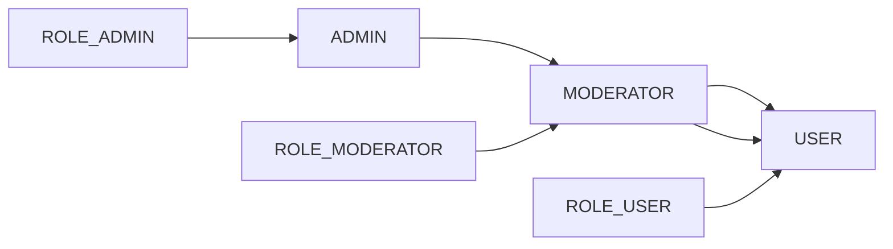

# Task Management System - SoftUni Web Project

### Roles hierarchy and information:

- ROLE_ADMIN ```ADMIN, MODERATOR, USER```

- ROLE_MODERATOR ```MODERATOR, USER```

- ROLE_USER ```USER```

### Basic Diagram:



# Authentication information:

- All endpoints except anonymous ones require authentication

## Endpoints:

### 1. ANONYMOUS_ENDPOINTS

@GetMapping

- http://localhost:8080/
- http://localhost:8080/users/login
- http://localhost:8080/users/register
- http://localhost:8080/login-error

@PostMapping

- http://localhost:8080/users/login-error

### 2. ROLE_USER_ENDPOINTS

@GetMapping

- http://localhost:8080/home
- http://localhost:8080/users/profile
- http://localhost:8080/users/tasks/all
- http://localhost:8080/users/tasks/add-task
- http://localhost:8080/users/posts/related-to-task-id/{taskId} - ЗА КОРЕКЦИЯ
- http://localhost:8080/users/posts/create-new-post-to-task/{taskId}
- http://localhost:8080/users/comments/to-post/{postId}
- http://localhost:8080/users/change-password

@PostMapping

- http://localhost:8080/users/tasks/add-task
- http://localhost:8080/users/posts/create-new-post
- http://localhost:8080/users/change-password

@PatchMapping

- http://localhost:8080/users/tasks/assign-logged-user-to-task-by-task-id/{taskId} - ЗА КОРЕКЦИЯ
- http://localhost:8080/users/tasks/detach-logged-user-from-task-by-task-id/{taskId}

### 2. ROLE_MODERATOR_ENDPOINTS

### 4. ROLE_ADMIN_ENDPOINTS

@GetMapping

- http://localhost:8080/admin/all-users
- http://localhost:8080/admin/roles
- http://localhost:8080/admin/user-details/{userId}
- http://localhost:8080/admin/user-edit/{userId}
- http://localhost:8080/admin/user-edit/{userId}
- http://localhost:8080/admin/all-departments
- http://localhost:8080/admin/department-details/{departmentId}

@PatchMapping

- http://localhost:8080/admin/user-edit/{userId}
- http://localhost:8080/admin/user-edit-role/{userId}

@DeleteMapping

- http://localhost:8080/admin/user-delete/{userId}

## FOLDERS:

### STATIC_RESOURCES

- /resources/**
- /resources/static/css/**
- /resources/static/images/**
- /resources/static/js/**
- /resources/static/fragments/**
